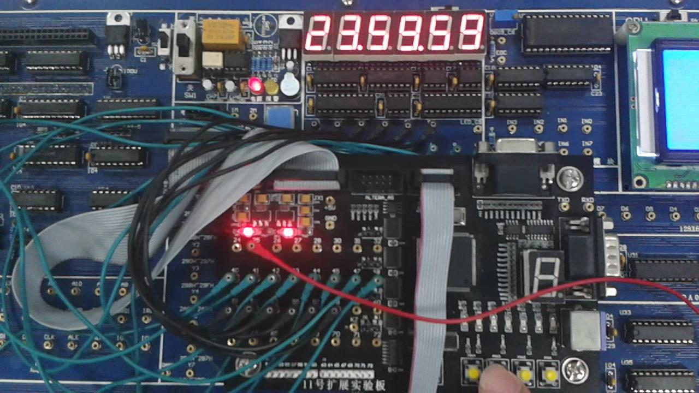

# DigitalClock

A digital clock in SystemVerilog on FPGA.

The numbers are displayed on a 6-digit digitron.

Three buttons for setting the time, which are `Mode Set`, `Increase` and `Decrease`.

For a video demonstration see `demo/20180515_194929.mp4`.
